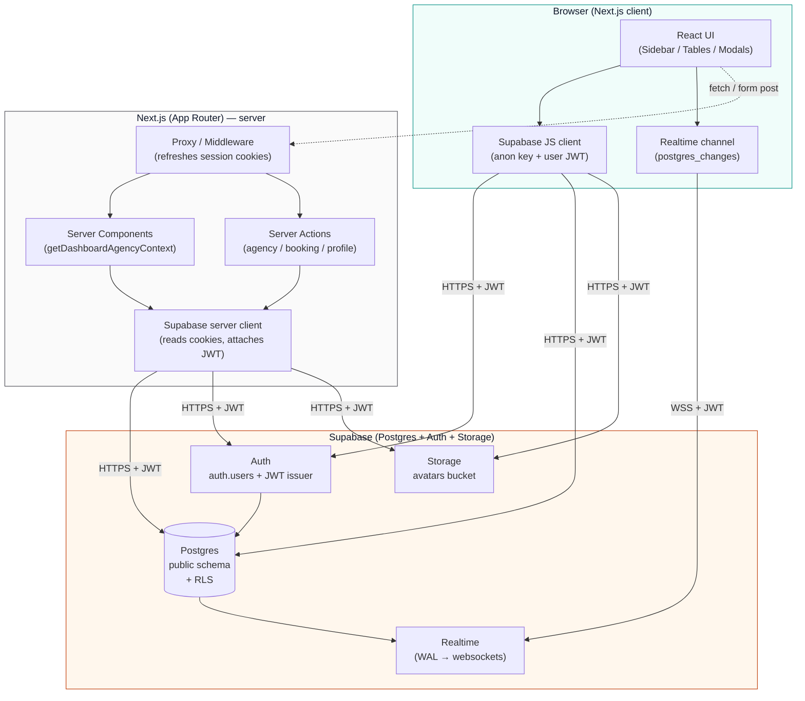
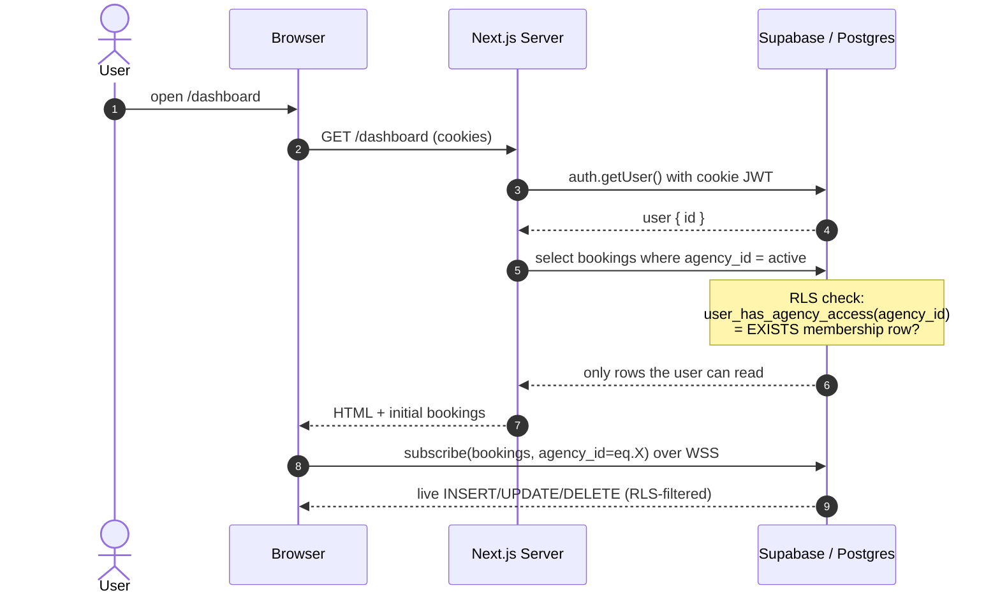
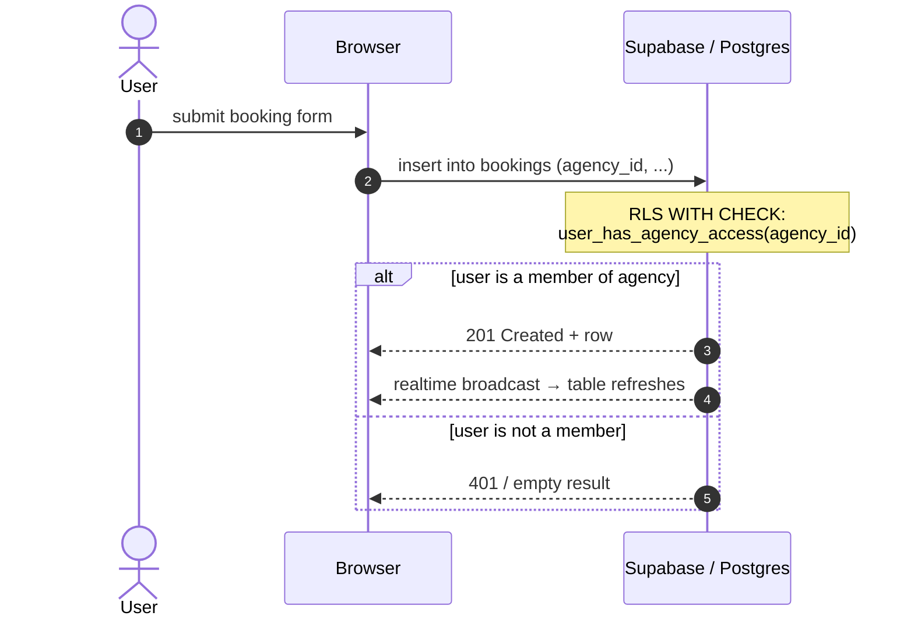

# Voyager — Architecture & Security

A multi-tenant booking portal for travel agencies. Each agency's data is fully isolated from every other agency's data, enforced at the database layer (not the application layer) via Postgres Row-Level Security.

---

## 1. Architecture Diagram



### Layers

| Layer | Stack | Responsibility |
|---|---|---|
| **Client** | React 19, Next.js App Router, Tailwind v4, lucide-react | UI rendering, optimistic updates, opens Supabase Realtime channel for live booking updates |
| **Edge / Server** | Next.js Server Components, Server Actions, `proxy.ts` (formerly `middleware.ts`) | Resolves the user's session from HTTP-only cookies, fetches initial dashboard data, executes mutations |
| **Auth** | Supabase Auth (`@supabase/ssr`) | Issues a signed JWT containing `sub = auth.uid()`. The JWT is stored in HTTP-only cookies and forwarded with every Supabase call |
| **Database** | Postgres + RLS | All authorization decisions live here. The app code never filters data by `agency_id` for security — RLS does it |
| **Storage** | Supabase Storage `avatars` bucket | Public-readable, write-restricted by user folder path |
| **Realtime** | `postgres_changes` on `public.bookings` | Streams `INSERT/UPDATE/DELETE` to subscribed clients, also subject to RLS |

### Data flow — viewing bookings (read path)



### Data flow — creating a booking (write path)



### Key files

| Path | Purpose |
|---|---|
| [src/lib/supabase/server.ts](../src/lib/supabase/server.ts) | Server Supabase client — reads cookies, attaches user JWT |
| [src/lib/supabase/client.ts](../src/lib/supabase/client.ts) | Browser Supabase client — uses anon key + session cookies |
| [src/middleware.ts](../src/middleware.ts) | Refreshes the session on every request, redirects unauthenticated users |
| [src/lib/agency/server.ts](../src/lib/agency/server.ts) | `getDashboardAgencyContext()` — single source of truth for the active user, profile, and the agencies they belong to |
| [src/app/actions/](../src/app/actions/) | Server actions for create/update/delete on agencies, bookings, profile |
| [src/sql/schema.sql](../src/sql/schema.sql) | Canonical schema, RLS policies, RPCs, storage policies |

---

## 2. Row-Level Security (RLS)

### The threat model

A naive implementation filters by `agency_id` in the React component or in a `WHERE` clause inside the API route. That's not security — it's a coincidence. Anyone with the public Supabase URL and anon key can open DevTools, grab them from a network request, and run:

```js
const sb = createClient(URL, ANON_KEY)
await sb.auth.signInWithPassword({ email, password }) // their own login
await sb.from('bookings').select('*')                  // omitting any filter
```

If RLS isn't real, that returns **every booking in every agency**. Voyager prevents this entirely at the database layer — even with a valid JWT, the same query only returns rows the user is a member of.

### Identity: how Postgres knows who you are

1. The user signs in. Supabase Auth issues a JWT signed with the project's secret. Its `sub` claim is the user's `id` from `auth.users`.
2. The JWT is stored in HTTP-only cookies (server) and `localStorage` (client) by `@supabase/ssr`.
3. Every PostgREST request — REST, Realtime, or Storage — includes the JWT in `Authorization: Bearer ...`.
4. Postgres receives the JWT, validates the signature, and exposes the claims via `auth.uid()` (a function defined by the Supabase Auth extension that returns the `sub` claim of the current request's JWT).
5. `auth.uid()` is then available inside every RLS policy, `SECURITY DEFINER` function, and trigger.

> The JWT cannot be forged because the client never sees the signing key. If a user tampers with the cookie, signature verification fails and `auth.uid()` returns `NULL` — which causes every membership check below to evaluate `false`.

### Schema layout (the membership join table)

The schema is a classic many-to-many between users and tenants:

```
auth.users  ── 1 ──┐
                   │
           public.users      public.agencies
                   │              │
                   └─── public.agency_members ───┘
                        (user_id, agency_id, role)

           public.bookings.agency_id  →  public.agencies.id
```

A user can belong to multiple agencies; an agency can have multiple users. **Every booking is hard-bound to exactly one `agency_id`** via a `NOT NULL` foreign key with `ON DELETE CASCADE`.

### The membership helper function

```sql
CREATE OR REPLACE FUNCTION public.user_has_agency_access(agency_uuid UUID)
RETURNS BOOLEAN
LANGUAGE sql
STABLE
SECURITY DEFINER
SET search_path = public
AS $$
  SELECT EXISTS (
    SELECT 1 FROM public.agency_members
    WHERE agency_id = agency_uuid AND user_id = auth.uid()
  );
$$;
```

Notes:

- **`SECURITY DEFINER`** lets it run with the table-owner's privileges so it can read `agency_members` even when the user has no direct read grant — necessary because the membership check itself bypasses RLS
- **`SET search_path = public`** prevents schema-injection attacks
- **`STABLE`** lets Postgres cache the result within a single statement
- It's the **only** primitive every booking/agency policy needs — change membership semantics in one place

### RLS policies — `bookings`

```sql
ALTER TABLE public.bookings ENABLE ROW LEVEL SECURITY;

CREATE POLICY "Members can view bookings"
  ON public.bookings FOR SELECT
  USING (public.user_has_agency_access(agency_id));

CREATE POLICY "Members can create bookings"
  ON public.bookings FOR INSERT
  WITH CHECK (public.user_has_agency_access(agency_id));

CREATE POLICY "Members can update bookings"
  ON public.bookings FOR UPDATE
  USING (public.user_has_agency_access(agency_id));

CREATE POLICY "Members can delete bookings"
  ON public.bookings FOR DELETE
  USING (public.user_has_agency_access(agency_id));
```

What each clause means:

| Clause | When evaluated | Effect |
|---|---|---|
| `USING` (SELECT/UPDATE/DELETE) | Per existing row, before the operation | The row is invisible if the predicate is false |
| `WITH CHECK` (INSERT/UPDATE) | Per row being written, before commit | The write fails if the predicate is false — even if you supplied a fake `agency_id` |

For `UPDATE`, both run: the user can only see rows they belong to (`USING`) and can't move a row into an agency they don't belong to (`WITH CHECK`).

### RLS policies — supporting tables

```sql
ALTER TABLE public.users ENABLE ROW LEVEL SECURITY;
CREATE POLICY "Users can view own profile"   ON public.users FOR SELECT USING (id = auth.uid());
CREATE POLICY "Users can update own profile" ON public.users FOR UPDATE USING (id = auth.uid());

ALTER TABLE public.agencies ENABLE ROW LEVEL SECURITY;
CREATE POLICY "Members can view agencies they belong to"
  ON public.agencies FOR SELECT USING (public.user_has_agency_access(id));
CREATE POLICY "Members can update agencies they belong to"
  ON public.agencies FOR UPDATE USING (public.user_has_agency_access(id));

ALTER TABLE public.agency_members ENABLE ROW LEVEL SECURITY;
CREATE POLICY "Users can view own memberships"
  ON public.agency_members FOR SELECT USING (user_id = auth.uid());
```

- **`users`** — you can only read or update your own profile row
- **`agencies`** — you can only see and update agencies you're a member of
- **`agency_members`** — you can only see your own membership rows. Nobody can list other users' memberships, even if they're in the same agency, which prevents user enumeration

### Why no INSERT policy on `agencies` or `agency_members`?

Creating an agency must atomically:

1. Insert into `public.agencies`
2. Insert into `public.agency_members` with `role = 'owner'` for the current user

If we exposed those tables to direct `INSERT`, a user could insert an `agency` row without ever inserting the corresponding `agency_members` row, leaving an orphan that nobody owns. Worse, they could insert an `agency_members` row referencing somebody else's agency.

Instead, both are wrapped in a `SECURITY DEFINER` RPC that the user calls atomically:

```sql
CREATE OR REPLACE FUNCTION public.create_agency_for_user(p_name TEXT)
RETURNS UUID
LANGUAGE plpgsql
SECURITY DEFINER
SET search_path = public
AS $$
DECLARE new_id UUID;
BEGIN
  IF auth.uid() IS NULL THEN
    RAISE EXCEPTION 'Not authenticated';
  END IF;
  INSERT INTO public.agencies (name) VALUES (TRIM(p_name)) RETURNING id INTO new_id;
  INSERT INTO public.agency_members (user_id, agency_id, role)
  VALUES (auth.uid(), new_id, 'owner');
  RETURN new_id;
END;
$$;

GRANT EXECUTE ON FUNCTION public.create_agency_for_user(TEXT) TO authenticated;
```

The same pattern protects `delete_agency_for_user(p_agency_id)`, which additionally checks that the caller has `role = 'owner'` before allowing the cascade delete.

### Storage — avatar bucket

The `avatars` bucket is **public for read**, **per-user write**:

```sql
CREATE POLICY "Authenticated users can upload avatars"
  ON storage.objects FOR INSERT
  TO authenticated
  WITH CHECK (
    bucket_id = 'avatars'
    AND (storage.foldername(name))[1] = auth.uid()::text
  );
```

The client uploads to `${user.id}/avatar-${Date.now()}.png`. RLS extracts the first folder segment and refuses the upload unless it equals the caller's `auth.uid()`. The same predicate guards UPDATE and DELETE — a user cannot overwrite or remove anyone else's avatar even by guessing the path.

### Realtime — `postgres_changes`

`bookings` is added to the `supabase_realtime` publication. When a row changes, the Realtime server replays the change to every subscribed client **after re-running the same RLS policies under that client's JWT**. So when Agency A inserts a booking, only members of Agency A receive the websocket event — even though all clients are subscribed to the same logical channel.

### Defense-in-depth: how an attacker would try to leak data, and what stops them

| Attack | What they do | What stops it |
|---|---|---|
| **Drop the WHERE clause** | `sb.from('bookings').select('*')` with no filter | RLS `USING` predicate filters at query plan time |
| **Pass another agency's UUID** | `sb.from('bookings').select('*').eq('agency_id', 'OTHER')` | RLS still requires `user_has_agency_access(agency_id)` |
| **Insert with a fake `agency_id`** | `sb.from('bookings').insert({ agency_id: 'OTHER', ... })` | `WITH CHECK` predicate rejects it |
| **Update to escape into another agency** | `update().eq('id', myRow).set({ agency_id: 'OTHER' })` | `WITH CHECK` on the new agency_id rejects it |
| **Subscribe to the realtime channel for another agency** | `channel('postgres_changes', { filter: 'agency_id=eq.OTHER' })` | Realtime re-applies RLS per row before broadcasting |
| **Forge a JWT** | Edit the cookie | Signature mismatch → `auth.uid()` is `NULL` → all checks fail |
| **Guess another user's avatar URL** | `${otherUserId}/...` | Bucket is public-read by design (avatars are not secret), but write/delete require `auth.uid()::text` to match the folder |
| **Create an orphan agency / escalate to owner** | Direct `INSERT` into `agencies` or `agency_members` | No INSERT policies exist on either table — only the `SECURITY DEFINER` RPC can do it, and it always adds the *caller* as owner |
| **Delete an agency you don't own** | Call the RPC with someone else's UUID | RPC verifies `role = 'owner'` for the calling `auth.uid()` before deleting |

### How to verify RLS is real

This is the exact procedure Voyager passes:

1. Sign up two users (User A, User B) and create two agencies, A and B
2. Open the live app as User A and seed a few bookings under Agency A
3. Open DevTools → Network → grab the Supabase **URL** and **anon key** from any request header
4. In a fresh console (or a different browser), run:

   ```js
   import { createClient } from '@supabase/supabase-js'
   const sb = createClient(URL, ANON_KEY)
   await sb.auth.signInWithPassword({ email: 'userB@example.com', password: '...' })
   const { data, error } = await sb.from('bookings').select('*')
   console.log(data, error)
   ```

5. Expected result: `data` contains only Agency B's bookings (or `[]` if Agency B has none). **Zero** Agency A rows. Try changing the query to `.eq('agency_id', '<agency-A-uuid>')` — still empty.
6. Try `await sb.from('bookings').insert({ agency_id: '<agency-A-uuid>', booking_ref: 'X', client_name: 'X', activity: 'X', travel_date: '2026-01-01', amount: 1, status: 'pending' })` — returns an RLS error.

If steps 5 or 6 leak data, RLS is faked. Voyager passes both.

### Things RLS doesn't do (and why that's fine)

- **RLS doesn't replace input validation.** Form fields are still validated server-side in the action layer (e.g. `firstName.trim()` non-empty)
- **RLS doesn't replace authentication.** A request without a valid JWT has `auth.uid() = NULL`, which fails every membership check. The middleware redirects unauthenticated users to `/login` for a better UX
- **RLS doesn't hide column existence.** A user always knows the *shape* of `bookings`, just not the *contents* of rows they don't own. That's the appropriate boundary for a multi-tenant SaaS
